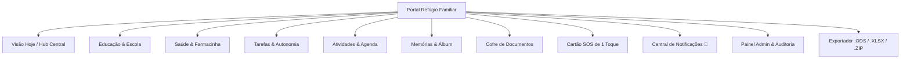

# 🏡 Refúgio Familiar — Plataforma de Acompanhamento Infantil & Rotina Familiar

[](https://reactjs.org/)
[](https://www.typescriptlang.org/)
[](https://vitejs.dev/)
[](https://tailwindcss.com/)
[](https://github.com/MathSMB/diario-escolar)
[](LICENSE)

> Uma plataforma web moderna, serena e humanizada desenvolvida para famílias, pais, mães e cuidadores organizarem com clareza a rotina, saúde, educação, medicamentos, documentos e memórias das crianças — com soberania de dados a custo zero e estética inspirada em papelaria editorial de luxo.

---

## 📑 Sumário

- [Visão Geral & Proposta de Valor](#-visão-geral--proposta-de-valor)
- [Design System & Estética](#-design-system--estética-papelaria-editorial)
- [Principais Funcionalidades](#-principais-funcionalidades)
- [Soberania de Dados & Exportação Aberta](#-soberania-de-dados--exportação-aberta)
- [Arquitetura & Estrutura do Projeto](#-arquitetura--estrutura-do-projeto)
- [Stack Tecnológica](#-stack-tecnológica)
- [Como Executar Localmente](#-como-executar-localmente)
- [Scripts Disponíveis](#-scripts-disponíveis)
- [Segurança & Privacidade](#-segurança--privacidade)
- [Histórico de Implementação](#-histórico-de-implementação)

---

## 🌿 Visão Geral & Proposta de Valor

O **Refúgio Familiar** transforma o estresse da sobrecarga mental materna e paterna em uma experiência acolhedora, serena e fluida. A plataforma centraliza todas as informações essenciais de múltiplos filhos em uma interface de alta ergonomia e sem ruídos visuais.

### Destaques:
- 🆘 **Cartão SOS de 1 Toque:** Acesso imediato a tipos sanguíneos, alergias graves, medicamentos contínuos, contatos do pediatra com discagem direta e convênio médico sem truncamento.
- 💊 **Farmacinha & Doses Conectadas:** Linha do tempo de medicamentos, controle de horários com contagem regressiva, upload e visualização da foto da receita original e registro do cuidador que administrou.
- 🎒 **Escola & Mochila Inteligente:** Grade horária semanal, controle de professores, salas, avaliações bimestrais e checklist diário de mochila.
- 🗃️ **Cofre Seguro de Documentos:** Armazenamento organizado de certidões de nascimento, laudos clínicos, carteirinhas de vacinação e contratos escolares.
- 📊 **Soberania de Dados & Portabilidade:** Exportação completa de todas as 16 tabelas em formato de planilha aberta **.ODS** (OpenDocument compatível com LibreOffice, Google Sheets, Numbers e Excel) e download de fotos categorizadas em arquivo **.ZIP**.
- 🛡️ **Painel Administrativo & Trilha de Auditoria (RBAC):** Dashboard completo de métricas SaaS, gestão de papéis (*Mamãe*, *Papai*, *Cuidador*, *Admin*) e logs imutáveis (*5 Ws*).

---

## 🎨 Design System & Estética (Papelaria Editorial)

O projeto rejeita interfaces genéricas e adota uma paleta calorosa com inspiração em cadernos artesanais de linho e tons botânicos:

| Token | Cor Hex | Uso Principal |
| :--- | :--- | :--- |
| **Creme de Linho** | `#F7F4F0` | Fundo principal da aplicação (`bg-canvas`) |
| **Alabaster Warm** | `#FFFFFF` / `#FCFBF9` | Superfície dos cartões e modais (`bg-surface`) |
| **Terracota Aveludado** | `#BC7C67` | Elementos de destaque, CTAs primários e badges |
| **Sage / Sálvia Calmante** | `#8A9A8C` | Saúde, remédios e indicadores positivos |
| **Slate Suave** | `#7D8C99` | Documentos, contratos e elementos de arquivo |
| **Ink / Tinta Nanquim** | `#2D2926` | Tipografia principal de alta legibilidade |

**Tipografia Curada:**
- **Títulos & Ênfases:** *Fraunces* (Serifa clássica, calorosa e elegante)
- **Interface & Textos:** *Plus Jakarta Sans* (Sans-serif moderna de alta densidade e legibilidade)

---

## 🚀 Principais Funcionalidades



### 1. Visão Hoje & Hub Central
- Cronograma diário em ordem cronológica de aulas, atividades e doses.
- Resumo tático do dia: total de aulas, remédio ativo com horário da próxima dose, checklists de mochila e tarefas de autonomia infantil.
- Seletor rápido de perfil entre os filhos (*Helena*, *Mateo*, *Laura*, *Lucas*) ou *Visão Geral Unificada*.

### 2. Cartão Clínico de Emergência (SOS)
- Acionamento imediato em 1 clique no cabeçalho ou no card do perfil.
- Alergias com bandeira de severidade (*Grave / Moderada*), restrições alimentares e tipo sanguíneo.
- Botões de discagem rápida para Pediatra, Hospital e Contatos de Emergência.
- Dados de convênio médico com quebra fluida sem truncamento.

### 3. Saúde, Farmacinha & Doses
- Gestão de antibióticos e medicamentos de uso contínuo com cálculo automático da próxima dose.
- Foto da receita médica sincronizada, instruções de administração e anotações clínicas.
- Carteira de Vacinação completa (calendário PNI e vacinas complementares).
- Curva de crescimento infantil com histórico de altura, peso e percentis OMS.

### 4. Educação & Mochila Pronta
- Grade de matérias com horários, salas e professores por dia da semana.
- Acompanhamento de notas, provas agendadas e trabalhos escolares.
- Checklist interativo de itens essenciais na mochila.

### 5. Produtividade & Autonomia
- Checklists de hábitos da manhã, tarde e noite.
- Gamificação positiva através do ganho de estrelas por metas cumpridas.
- Mural de notas rápidas do lar e recados para a família.

### 6. Memórias & Obras de Arte
- Álbum fotográfico categorizado por eventos e passeios.
- Galeria de arte infantil com digitalização de desenhos e pinturas.
- Livro de marcos de desenvolvimento e conquistas da infância.

### 7. Central de Lembretes & Notificações (Sininho 🔔)
- Badge dinâmico no topo informando o volume de notificações pendentes.
- Avisos em tempo real de doses de antibióticos com contagem regressiva, eventos escolares e consultas médicas.
- Filtros por categoria e controle de lido/não lido.

---

## 💾 Soberania de Dados & Exportação Aberta

O Refúgio Familiar prioriza a **privacidade e independência total da família**, garantindo que nenhum dado fique preso na plataforma:

| Formato | Finalidade | Compatibilidade |
| :--- | :--- | :--- |
| **.ODS** *(OpenDocument Spreadsheet)* | Planilha Aberta Internacional (ISO/IEC 26300) | LibreOffice Calc, OpenOffice, Google Planilhas, Apple Numbers, MS Excel |
| **.XLSX** *(Microsoft Excel)* | Pasta de trabalho multi-abas | Microsoft Excel, Google Planilhas, WPS Office |
| **.CSV** *(Universal)* | Arquivos de texto delimitados com cabeçalho UTF-8 BOM | Qualquer editor de planilhas ou banco de dados relacional |
| **.ZIP** *(Pacote de Imagens)* | Arquivo compactado com fotos organizadas em pastas | Qualquer sistema operacional (Windows, macOS, Linux, Android, iOS) |

### 16 Tabelas Integradas no Exportador:
1. `Resumo_Familiar`
2. `Perfil_Criancas`
3. `Ficha_SOS_Clinica`
4. `Contatos_Emergencia`
5. `Medicamentos_Ativos`
6. `Historico_Doses`
7. `Carteira_Vacinas`
8. `Crescimento_OMS`
9. `Grade_Escolar`
10. `Avaliacoes_Notas`
11. `Checklist_Mochila`
12. `Tarefas_Autonomia`
13. `Atividades_Rotina`
14. `Album_Memorias`
15. `Obras_Arte`
16. `Cofre_Documentos`

---

## 🏗️ Arquitetura & Estrutura do Projeto

```text
diario-escolar/
├── .agents/                      # Skills locais (Copywriting e Práticas de Admin)
│   └── skills/
│       ├── boas-praticas-de-admin/
│       └── copywriting-familiar/
├── public/                       # Assets estáticos e favicons
├── src/
│   ├── components/
│   │   ├── admin/                # Dashboard Administrativo SaaS & Auditoria (RBAC)
│   │   ├── auth/                 # Portal de Login, Cadastro, OAuth & Edição de Perfil
│   │   ├── landing/              # Landing Page editorial e de recepção
│   │   ├── layout/               # Header com SOS/Notificações, Navbar e Barra Mobile
│   │   ├── modules/              # Modais (SOS, Lembretes, Exportador ODS/ZIP, etc.)
│   │   └── ui/                   # Componentes atômicos reutilizáveis
│   ├── config/                   # Configurações do sistema e papéis de usuário
│   ├── context/
│   │   ├── AuthContext.tsx       # Estado de sessão, login social, visitante e usuários
│   │   └── FamilyContext.tsx     # Estado global normalizado com CRUD completo dos 4 filhos
│   ├── data/
│   │   └── mockData.ts           # Base de dados rica e demonstrativa (Helena, Mateo, Laura, Lucas)
│   ├── services/
│   │   ├── adminService.ts       # Métricas SaaS, logs de auditoria e exportação admin
│   │   ├── exportService.ts      # Gerador de planilhas .ODS / .XLSX / .CSV
│   │   └── imagePackService.ts   # Gerador de arquivo compactado .ZIP categorizado
│   ├── types/
│   │   └── index.ts              # Tipagens estritas em TypeScript
│   ├── views/                    # Telas principais (Hoje, Educação, Saúde, Tarefas, etc.)
│   ├── App.tsx                   # Roteamento de telas e provedores globais
│   ├── index.css                 # Design tokens Tailwind e variáveis CSS
│   └── main.tsx                  # Ponto de entrada da aplicação
├── historico-de-implementacao.md # Registro técnico cronológico das 13 fases
├── package.json
├── tailwind.config.js
├── tsconfig.json
└── vite.config.ts
```

---

## 🛠️ Stack Tecnológica

- **Front-end Core:** React 18.3 & TypeScript 5.6
- **Build Tool:** Vite 6.0 (HMR ultra-rápido)
- **Estilização:** TailwindCSS 3.4 com tokens customizados
- **Ícones:** Lucide React
- **Processamento de Planilhas:** SheetJS (`xlsx`) para geração de formatos abertos `.ODS` e `.XLSX`
- **Manipulação de Arquivos ZIP:** JSZip para download de imagens organizadas em pastas
- **Gerenciamento de Estado:** React Context API + LocalStorage com hidratação automática

---

## 💻 Como Executar Localmente

### Pré-requisitos
- Node.js (versão 18.x ou superior)
- Gerenciador de pacotes `npm` ou `yarn`

### Passo a Passo:

1. **Clone o repositório:**
   ```bash
   git clone https://github.com/MathSMB/diario-escolar.git
   cd diario-escolar
   ```

2. **Instale as dependências:**
   ```bash
   npm install
   ```

3. **Inicie o servidor de desenvolvimento:**
   ```bash
   npm run dev
   ```

4. **Abra no navegador:**
   Acesse `http://localhost:4000/` (ou a porta informada no terminal).

---

## 📜 Scripts Disponíveis

| Comando | Descrição |
| :--- | :--- |
| `npm run dev` | Inicia o servidor Vite em modo de desenvolvimento |
| `npm run build` | Compila o TypeScript e gera o bundle de produção otimizado em `/dist` |
| `npm run preview` | Executa localmente o bundle de produção gerado para validação |

---

## 🔒 Segurança & Privacidade

- **Client-Side First:** Todos os dados inseridos são armazenados no `localStorage` do navegador do usuário.
- **Auditoria Transparente:** Painel administrativo com trilha de auditoria dos eventos (quem executou, quando e qual módulo).
- **Sem Lock-in:** O usuário é dono de 100% de seus dados e pode extrair a totalidade das tabelas e imagens a qualquer momento.

---

## 📖 Histórico de Implementação

Para consultar todas as decisões de engenharia, correções de bugs, evoluções de UI e detalhes das 13 fases do projeto, consulte o arquivo:
👉 [historico-de-implementacao.md](historico-de-implementacao.md)

---

## 📄 Licença

Este projeto é disponibilizado sob a licença [MIT](LICENSE). Sinta-se livre para utilizar, estudar e contribuir.

---

<div align="center">
  <sub>Criado com carinho e dedicação para transformar a rotina familiar em momentos de paz e harmonia. 🌿</sub>
</div>
